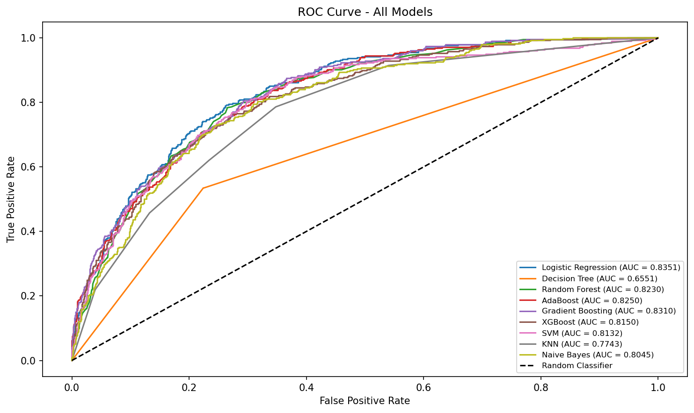
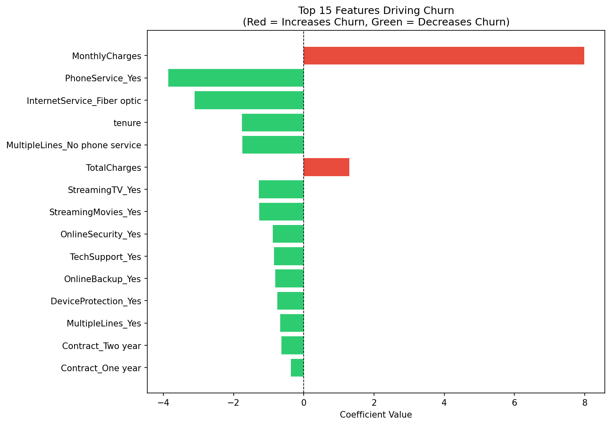
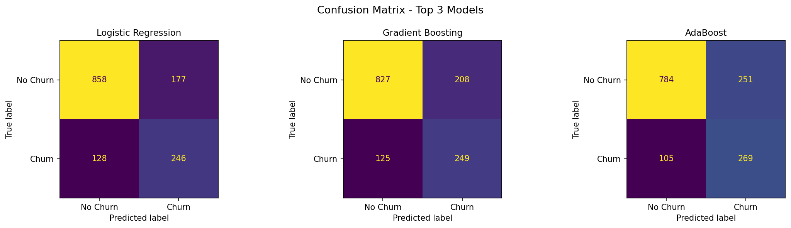

# 📉 Customer Churn Prediction

Predicting which telecom customers are likely to churn using 
machine learning — built end-to-end from raw data to model evaluation.

---

## 📌 Problem Statement
Customer churn is one of the biggest challenges in the telecom industry.
This project builds a classification model to identify high-risk customers
before they leave, enabling proactive retention strategies.

---

## 📊 Dataset
- **Source:** [Telco Customer Churn — Kaggle](https://www.kaggle.com/datasets/blastchar/telco-customer-churn)
- **Records:** 7,043 customers
- **Features:** 21 (demographics, services, account info)
- **Target:** Churn (Yes/No)

---

## 🔧 Tech Stack
- Python, Pandas, NumPy
- Scikit-learn, XGBoost
- Imbalanced-learn (SMOTE)
- Matplotlib, Seaborn

---

## 🚀 Project Workflow
1. Data Cleaning & Preprocessing
2. Exploratory Data Analysis (EDA)
3. Handling Class Imbalance using SMOTE
4. Training 9 ML Models
5. Evaluation using ROC-AUC, F1, Precision, Recall
6. Hyperparameter Tuning using RandomizedSearchCV

---

## 📈 Results

| Model               | ROC-AUC        |
|---------------------|----------------|
| Logistic Regression | 0.8363  ✅ Best |
| Gradient Boosting   | 0.8310         |
| AdaBoost            | 0.8250         |
| Random Forest       | 0.8230         |
| XGBoost             | 0.8150         |
| Decision Tree       | 0.6551         |

---

## 📊 Visualizations

### ROC Curve


### Feature Importance


### Confusion Matrix


---

## 💡 Key Findings
- Logistic Regression outperformed all ensemble methods (ROC-AUC: 0.8363)
- Gradient Boosting overfit after tuning — original model was better
- Decision Tree alone (0.6551) vs Random Forest (0.8230) proves the
  power of bagging
- Top churn drivers: Contract type, Tenure, Monthly Charges

---

## 🏢 Business Recommendation
Month-to-month contract customers with high monthly charges
and low tenure are the highest churn risk — target them first
with retention offers.
```